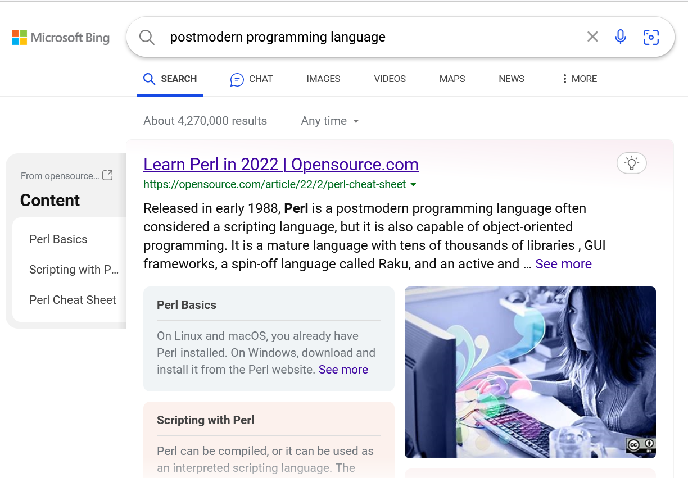

# 后现代编程语言介绍

## 什么叫后现代编程语言？

你猜？

## 预览

* Perl 历史
* Perl 设计理念：TIMTOWTDI
  * TIMTOWTDI 的范式
  * TIMTOWTDI 的语法
* Perl 很方便
  * You GUESS？
  * PCRE
  * Perl 的不知道多少个操作符
* Perl 的缺点
* 鬼畜代码大赏
  * JAPH
  * Golf
  * Poetry
  * 我的作品

## Perl 历史

应该没人会对 Perl 的历史感兴趣……所以这里就列举几个比较有趣的东西好了。

* Perl 1 发布于 1987 年，比 ANSI-C 还早。这就导致 1998 年发布 Perl 5.005 时提到了一句 “Source code now in ANSI C”。
* Perl 在 1987-1991 四年中发布了 Perl 1 到 Perl 4 四个版本。但是 1993 年发布了 Perl 5 之后，大版本号就再也没变过了。基本上可以认为，Perl 已经 29 年没发生过大的 breaking change 了。
* Perl 社区几年前试着设计了 Perl 6。结果发现设计出来的东西和 Perl 5 完全是两个东西，于是给它改了个名字叫 “Raku”。
* Perl 7 正在开发！它将会与 Perl 5 兼容。

## Perl 设计理念：TIMTOWTDI

> There Is More Than One Way To Do It

做一件事不仅有一种方法。

## TIMTOWTDI 的范式

有些坏比语言，会限制你 “只能面向对象” 或者 “不要副作用” 之类的，非常不人道！代码一下子就变得难写了！

但是 Perl 非常包容，以下将展示一些合法并且有用的 Perl 代码。

---

假装我们在写 C

    my $acc = 0;
    for (my $i = 0; $i < 100; $i++) {
        $acc += $i;
    }
    printf("%d\n", $acc);

---

假装我们在写 shell script

    if ( -d '/var/log/v2ray' ) {
        chdir '/var/log/v2ray';
        for $file (<*.log>) {
            $size = `stat -c %s $file`;
            say "size of $file is $size";
        }
    }

---

我一天不 new 浑身难受。

    use JSON;

    my $ds = {
        perl => 'yes',
    };

    sub main {
        my $json = new JSON;

        my $text = $json->encode($ds);
        my $pretty = $json->pretty->encode($ds);

        printf("%s\n", $text);
    }

    main;

---

我一直是链式调用的粉丝啊

    my $say = sub { say join ",", @_ };
    my $length = sub { length shift };
    my $double = sub { shift() * 2 };
    my $add = sub { shift() + shift() };

    "hello,world"->$length()->$double()->$add(42)->$say();

---

我一直是 S-expression 的粉丝啊

    use List::Util qw/sum min max first shuffle/;
    say
    (sum
    (min 1, 2, 3, 4, ),
    2,
    (first
      { $_ > 3 }
      (shuffle 4, 5, 6, 8, 2)));

---

函数要是一等公民

    sub compose ($f, $g) {
        sub { $f->($g->(@_)) }
    }

    my $h = compose(
        sub ($x) { $x ** 2 },
        sub ($x) { $x + 3 },
    );

    $h->(2)

---

谁说 sed 和 awk 不是语言？

    #!/usr/bin/perl -n
    s/^\s+//;s/\s+$//;s/android/harmonyos/g;

    #!/usr/bin/perl -a
    if ($NR > 10) { print $F[2] }

---

## TIMTOWTDI 的语法

Perl 的语法很灵活的。

---

一般我们会把 `if` 写成这样：

    if ($ok) { say 'hello'; }

但是这样也是可以的

    say 'hello' if $ok;

再邪恶一点

    say 'hello' unless not $ok;

---

一般我们会把函数调用写成这样：

    printf("hello, world\n");

但是这样也是可以的，就像 shell 一样

    printf "hello, world\n";

也可以不加空格，只要解释器认得出来

    printf"hello, world\n";

极大地减少了 typo 数量！

---

## Perl 很方便

除了灵活的语法，Perl 还有一些内置功能，以及约定来简化代码编写

## You GUESS？

    while (<>) {
        chomp;
        s/open\s*ai/csdn/gi;
        say join "\n", split /\s+/;
    }

很多 Perl 函数会把默认的参数与结果放到特殊变量 `$_` 里面。所以写 Perl 代码经常写出 “把那什么拿过来，处理一下放到那里” 这样的东西，任务竟然还完成了（

## PCRE

大家都爱用的超级正则表达式。

PCRE 全称是 “Perl Compatible Regular Expression”。PCRE 是 BRE/ERE 的超集，而 Perl 本身的正则表达式又是 PCRE 的超集。

## Perl 的不知道多少个操作符

捡两个比较好玩的说说

### flip-flop 操作符

    while (<>) {
        next if /^begin/ .. /^end/;
        next if /^begin/ ... /^end/;
        say if 1 .. 100
    }

可以想象每个 flip-flop 操作符内部维护了一个布尔变量，它会在匹配到左边或右边的表达式时翻转。这个布尔变量的取值就是 flip-flop 操作符的取值。

### yada-yada 操作符

    ...

表示代码尚未完成。

## 其他魔法

* 运行时操作解释器符号表的程度的能力
* 变量绑定的程度的能力
* 各种逆天 pragma
* 还有很多……

## Perl 的缺点

* 设计老旧
* 过于灵活

## 鬼畜代码大赏

Perl 有各种神奇比赛，比谁更能玩弄 Perl 的语法规则。比如……

## JAPH 大赛

JAPH（有时是 YAPH）全称是 “Just Another Perl Hacker”。规则是在标准输出中输出 “Just Another Perl Hacker” 这句话。

这是最简单的：

    say"Just Another Perl Hacker"

这也是合法的：

    `$=`;$_=\%!;($_)=/(.)/;$==++$|;($.,
    $/,$,,$\,$",$;,$^,$#,$~,$*,$:,@%)=(
    $!=~/(.)(.).(.)(.)(.)(.)..(.)(.)(.)
    ..(.)......(.)/,$"),$=++;$.++;$.++;
    $_++;$_++;($_,$\,$,)=($~.$"."$;$/$%
    [$?]$_$\$,$:$%[$?]",$"&$~,$#,);$,++
    ;$,++;$^|=$";`$_$\$,$/$:$;$~$*$%[$?
    ]$.$~$*${#}$%[$?]$;$\$"$^$~$*.>&$=`

## 文学创作

这是一个合法的 Perl 代码：

    listen me, please;
    my $dear;

    please:
    `touch my heart`. read the, $message, in;
    sort my @feelings, and pop my @feelings;

    please:
    open your, heart;
    join us, together.

    let us tell world,
    that we are in love until time;

## 我的缝缝作品

