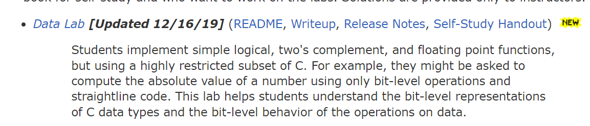

# CSAPP Data Lab 做题记录（上）

## 准备工作

访问 http://csapp.cs.cmu.edu/3e/labs.html 试图下载网页上醒目的 datalab.tar，发现需要身份验证。后来发现点后面的小东西可以直接下载。读了 readme 之后知道 datalab.tar 好像是教师用的，用来生成学生的包（datalab-handout），datalab-handout 才是学生用的。



读文档，知道实验是要用位运算来模拟各种整数运算，还要用整数运算模拟浮点运算。好像评测还实现了一个小工具来查是否用到了违规的操作符。

看文档上说需要安装 bison 和 flex，以为检查违规小工具也需要编译，正打算看一下代码发现包里直接发了个二进制文件下来……

发现评测程序是用 Perl 写的，古老。

Driverlab.pm 里好像手写了一个 http 客户端？看起来是搞那个 Beat the Prof 比赛的，应该不用管它。

依照手册指示，要先 make 一下把 btest 给编译好。结果遇到神奇问题：

```plain
% 09:19:42 jyi@Syameimaru-Aya ~/s/c/d/c/d/datalab-handout
0 make
gcc -O -Wall -m32 -lm -o btest bits.c btest.c decl.c tests.c
In file included from btest.c:16:
/usr/include/stdio.h:27:10: fatal error: bits/libc-header-start.h: No such file or directory
   27 | #include <bits/libc-header-start.h>
      |          ^~~~~~~~~~~~~~~~~~~~~~~~~~
compilation terminated.
In file included from decl.c:1:
/usr/include/stdio.h:27:10: fatal error: bits/libc-header-start.h: No such file or directory
   27 | #include <bits/libc-header-start.h>
      |          ^~~~~~~~~~~~~~~~~~~~~~~~~~
compilation terminated.
In file included from /usr/lib/gcc/x86_64-linux-gnu/10/include/limits.h:195,
                 from /usr/lib/gcc/x86_64-linux-gnu/10/include/syslimits.h:7,
                 from /usr/lib/gcc/x86_64-linux-gnu/10/include/limits.h:34,
                 from tests.c:3:
/usr/include/limits.h:26:10: fatal error: bits/libc-header-start.h: No such file or directory
   26 | #include <bits/libc-header-start.h>
      |          ^~~~~~~~~~~~~~~~~~~~~~~~~~
compilation terminated.
make: *** [Makefile:11: btest] Error 1
```

检查了一发发现是 makefile 里指定了 `-m32` 但是我没有 32 位的库，装了个 gcc-multilib。至于为啥不用 `-m64` 编译……因为那里面说什么 "not 64-bit safe"，没太懂。

## 题目列表

### bitXor

给定两个数，返回他们的异或。

首先由真值表写出把异或运算写成最小项之和的形式，就是 $X \oplus Y = X\bar{Y} + \bar{X}Y$。然后跑跑发现零分，是因为我们没有 `|` 可以用……用德摩根定律画画柿子得到 $\bar{\bar{X\bar{Y}}\bar{\bar{X}Y}}$，避开 `|`，就能过了。

```c
int bitXor(int x, int y) {
  return ~(~(~x & y) & ~(x & ~y));
}
```

### tmin

返回最小的有符号整数。

题目假设机器使用补码表示法，我们知道这个数的位模式应该长得比较像 1000...000。题目又假设了我们机器上的整数都是 32 位的，所以我们把 1 左移 31 位返回就行了。

```c
int tmin(void) {
  return 1 << 31;
}
```

### isTmax

判断给定的 x 是不是最大的有符号整数。

考虑到题目假定机器采用补码表示法，最大的有符号整数 tmax 的位模式应该是 01111...111。好像把 tmin 的结果取反就是了，但是他没给 `<<` 操作符，题目又禁止使用超过 255 的整数，所以 tmax 应该搞不出来。

倒是有一个检查加一向上溢出（假设溢出的行为和无符号整数差不多）取反后是不是和自己相等（`~(x + 1) == x`）的想法，但是有符号数溢出好像是 ub 啊。题目也没有规定溢出会采用什么方式。

先这么做好了……-1 要特判一下因为 -1 取反加一后马上就溢出了。

```c
int isTmax(int x) {
  return (!((~(x + 1)) ^ x)) & (!!(x + 1));
}
```

### allOddBits

判断给定 x 的奇数二进制位上是否全为 1。

……这样吗？

```c
int allOddBits(int x) {
  return (x >> 1) & (x >> 3) & (x >> 5) & (x >> 7) & (x >> 9) &
  (x >> 11) & (x >> 13) & (x >> 15) & (x >> 17) & (x >> 19) &
  (x >> 21) & (x >> 23) & (x >> 25) & (x >> 27) & (x >> 29) &
  (x >> 31) & 1;
}
```

测了一下发现性能分数没有拿到，最多只能使用 12 个操作符，而这里用了 33 个。考虑进行优化。因为我们可以直接使用 8 位整数，所以我们可以考虑将输入的东西每 8 位与一下，再用一个掩码检查得到的东西奇数位上是否都为 1。这样就能减少计算了。

```c
int allOddBits(int x) {
  return !((x & (x >> 8) & (x >> 16) & (x >> 24) & 0xaa) ^ 0xaa);
}
```

只用了 9 个操作符耶！

### negate

求给定数的相反数。

这个可以使用我们熟知的小结论，把 x 取反后再加一直接得到结果，非常简单。

```c
int negate(int x) {
  return (~x) + 1;
}
```

### isAsciiDigit

判断给定输入是不是 ASCII 编码中的数字。

我们已经有了比较两个数字是否相等的便利算法，只要打表检查是否等于每个可能的数字，将结果或起来就是最终答案。但是这样显然是拿不到性能分的嘛。

嗯……如果 x 的最高位为 1，那它是个负数，就不是 ASCII 的数字了。排除这种情况后，接下来就只要考虑正数比大小。

~~发现异或的结果的最高位是两个数字第一个不同之处，找出谁是 1 谁就更大。问题就变成了如何取一个数的最高位。~~并没有想到什么取一个数最高位的便利算法……

考虑利用一下题目特性，ASCII 的 0 和 9 是 110000 和 111001，想到搞一个东西来检查 x 的前面 26 位是否全为 0，而且第 5、6 位为 1。接着再判断后四位是否符合第四位为 0，或者第 2、3 位为零……

折腾一下得到这样的答案：

```c
int isAsciiDigit(int x) {
  return (!((~0x3f) & x)) & (!((0x30 & x) ^ 0x30)) &
	  (!(0x8 & x) | (!(0x6 & x)));
}
```

轻松过关

### conditional

实现类似三目运算符的功能。

要实现 `x ? y : z` 的话，应该很容易想到 `(!!x) * y + (!x) * z` 这种的……但是我们没有乘号。可以想到使用与号替代一下，就是想办法弄一个掩码，当 x 为真时它是全 1，x 为假时它是全零这种的。感觉比较简单。

代码里为了节省符号把掩码弄成当 x 为真时是全 0，x 为假时是全 1。使用方法还是差不多的吧。

```c
int conditional(int x, int y, int z) {
  int mask = !x;
  mask = (mask << 1) | mask;
  mask = (mask << 2) | mask;
  mask = (mask << 4) | mask;
  mask = (mask << 8) | mask;
  mask = (mask << 16) | mask;
  return ((~mask) & y) | (mask & z);
}
```

写后面的 howManyBits 的时候获得了重大技术革新，现在有一种便利操作来生成掩码了！

```c
int conditional(int x, int y, int z) {
  int mask = (~(!x)) + 1;
  return ((~mask) & y) | (mask & z);
}
```

如果 x 是 0，则 `~(!x)` 位模式为 1111...1110，加 1 后刚好是全 1。

如果 x 是 1，则 `~(!x)` 位模式为 1111...1111，加 1 向上溢出后刚好是全 0。

### isLessOrEqual

判断给定的两个数是否满足小于等于关系。

小于等于就是不大于嘛，接下来考虑判断两个数的大于关系。

~~这个好像在 isAsciiDigit 那个题里的踩过一次，所以接着思路往下想……如何取一个数的最高位。~~发现取最高位的话怎么写都会拿不完性能分。

突然想到好像两个数相减一下再判断结果是否为正数就行，原来刚刚想那么多是脑子打结了。

先判断两个数是否正好为一正一负，如果是的话可以直接给结果。否则相减判断结果正负，这时两个同号的数相减必不可能溢出。

```c
int isLessOrEqual(int x, int y) {
  return (((x >> 31) & 1) | (!(y >> 31))) &
	  ((((x >> 31) & 1) & (!(y >> 31))) | (!((y + (~x) + 1) >> 31)));
}
```

拿下。

### logicalNeg

实现逻辑非，不能使用感叹号。

感觉和 allOddBits 很像！只不过那个是求奇数位上全为 1，这里是求存在某一位为 1。

用类似的方法实现一下就好啦。

```c
int logicalNeg(int x) {
  x = x | (x >> 16);
  x = x | (x >> 8);
  x = x | (x >> 4);
  x = x | (x >> 2);
  x = x | (x >> 1);
  return 1 ^ (x & 1);
}
```

最后 return 那个奇怪的表达式其实是 `1 - x` 拆过来的。发现直接写 `2 + (~x)` 会拿不到性能分，符号刚好多一个。

### howManyBits 

求最少用多少个位可以表示出给定数字。

其实就是 $\log_{2}$ 啦。

先假定 x 是负数，根据补码表示法我们需要能够表示 $[ x, -x - 1 ]$ 的所有数。全部当成无符号整数之后需要表示的范围是 $[0, ((~x) << 1) + 1]$，只要我们能够用一些位表示出最大的数，那么这些位一定可以表示出所有数。因此答案就是 $\log_{2}(((~x) << 1) + 1)$（向上取整）。

同理，如果 x 是正数，则需要能够表示 $[ -x - 1, x ]$ 的所有数，答案是 $\log_{2}((x << 1) + 1)$。

至于如何取对数……猜测是要使用类似 logicalNeg 和 allOddBits 那样类似分治（？）的做法来完成，先考虑分成两半的情形：如果高 16 位不为零，可以给答案加上 16，接着再把高 16 位移动到低 16 位，按照类似的方式处理低 16 位；如果高 16 位为零，则直接处理低 16 位。依次类推直到处理完只剩一位的情况。

用力实现一下就好了。

```c
int howManyBits(int x) {
  int ans = 0;
  int h16, h8, h4, h2, h1, h0;
  int sign = x >> 31;
  int range = (((x & (~sign)) | ((~x) & sign)) << 1) + 1;

  h16 = (~(!!(range >> 16))) + 1;
  ans = ans + (h16 & 16);
  range = range >> (h16 & 16);

  h8 = (~(!!((range >> 8) & 0xff))) + 1;
  ans = ans + (h8 & 8);
  range = range >> (h8 & 8);

  h4 = (~(!!((range >> 4) & 0xf))) + 1;
  ans = ans + (h4 & 4);
  range = range >> (h4 & 4);

  h2 = (~(!!((range >> 2) & 0x3))) + 1;
  ans = ans + (h2 & 2);
  range = range >> (h2 & 2);

  h1 = (~(!!((range >> 1) & 0x1))) + 1;
  ans = ans + (h1 & 1);
  range = range >> (h1 & 1);

  h0 = (~(range & 0x1)) + 1;
  ans = ans + (h0 & 1);

  return ans;
}
```

真不容易！
