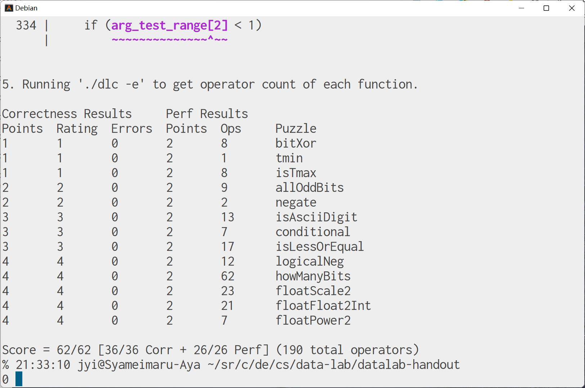

# CSAPP Data Lab 做题记录（下）

摸了好几天，来做浮点部分……

## 题目列表

### floatScale2 

传入一个无符号整数，把它当作单精度浮点数，乘二后输出。

很自然地想到提取出符号、阶码和尾数，接着根据是否为规格化的浮点数分情况处理，拼起来返回，比较简单。

```c
unsigned floatScale2(unsigned uf) {
  int sign, expo, frac;
  int bias = 127;
  sign = (uf >> 31) & ((1 << 1) - 1);
  expo = (uf >> 23) & ((1 << 8) - 1);
  frac = uf & ((1 << 23) - 1);
  if (expo == 0xff)
	  return uf;
  if (expo) {
	  ++expo;
	  if (expo == 0xff)
		  frac = 0;
  } else {
	  frac *= 2;
	  if (frac & (1 << 23)) {
		  expo = 1;
		  frac &= ~(1 << 23);
	  }
  }

  return (sign << 31) | (expo << 23) | frac;
}
```

### floatFloat2Int 

传入一个无符号整数 uf，把它当作单精度浮点数，返回它截断后的整数部分。也就是 `(int)uf`。如果出现溢出，则返回 0x80000000u（书上说这是与 Intel 兼容的微处理器指定的 “整数不确定” 值）。

感觉也比较简单……弄出阶码、尾数之后，暴力移位就行了。

代码里最后根据 sign 决定返回 ans 还是 -ans，而没有考虑最终结果为 INT_MIN，导致计算 ans 时溢出的问题。是因为 32 位的 float 类型无法精确表示 32 位的 INT_MIN，所以这里不用考虑 int 正负表示区间不对称的问题。

```c
int floatFloat2Int(unsigned uf) {
  int sign, expo;
  unsigned frac;
  int ans;
  int bias = 127;
  int error = 0x80000000u;
  sign = (uf >> 31) & ((1 << 1) - 1);
  expo = (uf >> 23) & ((1 << 8) - 1);
  frac = uf & ((1 << 23) - 1);

  if (expo == 0xff)
	  return error;
  expo -= bias;
  if (expo < 0)
	  return 0;
  if (expo > 31)
	  return error;
  frac |= (1 << 23);
  frac <<= 8;
  frac >>= (31 - expo);
  ans = frac;
  if (sign)
	  ans = -ans;
  return ans;
}
```

### floatPower2 

传入一个整数 $x$，返回单精度浮点数 $2^x$。如果结果太小则返回 0，太大则返回 +INF。

非常简单，只要改阶码部分，尾数部分保持全零即可。

```c
unsigned floatPower2(int x) {
    int bias = 127;
    int sign = 0;
    int expo = x + bias;
    int frac = 0;

    if (expo >= 0xff)
	    expo = 0xff;
    if (expo <= 0)
	    expo = 0;

    return (sign << 31) | (expo << 23) | frac;
}
```

## 总结

总体来看浮点数部分比整数部分简单，没准是因为前面写整数时把各种运算练得比较熟了？

做完了之后感觉自己对计算机中数字表示理解加深了~~甚至感觉可以全用位运算来实现各种操作符~~。

还有就是觉得整数的补码表示与 IEEE754 浮点数的一些性质特别神奇，怎么说不愧是广泛使用的标准。

调试时用了不少之前几乎没用过的联合体（union），应该说终于意识到这个东西怎么用了……

## 测试结果


