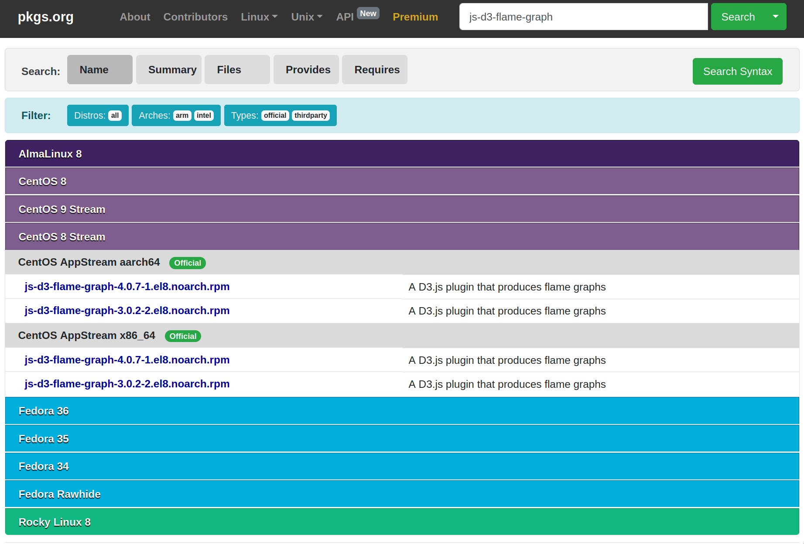
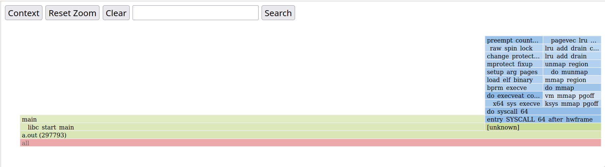

# Perf 笔记

环境 ``Linux Syameimaru-Aya 5.17.0-2-amd64 #1 SMP PREEMPT Debian 5.17.6-1 (2022-05-11) x86_64 GNU/Linux``。

## 配置环境

首先安装 ``linux-perf`` 软件包，获得 ``perf(1)`` 应用程序。

接着运行 ``perf``，发现报了奇怪的错误：

```plain
19:56 Syameimaru-Aya ~/sr/la/hpc/perf
0 perf record -a ./a.out
Error:
Access to performance monitoring and observability operations is limited.
Consider adjusting /proc/sys/kernel/perf_event_paranoid setting to open
access to performance monitoring and observability operations for processes
without CAP_PERFMON, CAP_SYS_PTRACE or CAP_SYS_ADMIN Linux capability.
More information can be found at 'Perf events and tool security' document:
https://www.kernel.org/doc/html/latest/admin-guide/perf-security.html
perf_event_paranoid setting is 3:
  -1: Allow use of (almost) all events by all users
      Ignore mlock limit after perf_event_mlock_kb without CAP_IPC_LOCK
>= 0: Disallow raw and ftrace function tracepoint access
>= 1: Disallow CPU event access
>= 2: Disallow kernel profiling
To make the adjusted perf_event_paranoid setting permanent preserve it
in /etc/sysctl.conf (e.g. kernel.perf_event_paranoid = <setting>)
```

跟着报错提示里面提到的文档 [Perf events and tool security](https://www.kernel.org/doc/html/latest/admin-guide/perf-security.html) 看了一圈，大概知道问题出在 ``perf`` 的安全措施上。文档里说，随意使用 ``perf`` 可能允许人获得其他人正在运行的程序中的数据，不安全。我用的发行版就默认配置成所有人都不能使用 ``perf`` 了。

文档给了一种多用户时控制权限，只让特定的人使用 ``perf`` 的做法：首先将 ``/usr/bin/perf`` 用 ``setcap(8)`` 程序加上 ``CAP_PERFMON`` ``CAP_SYS_PTRACE`` 两个标签，使 ``/usr/bin/perf`` 能够正常使用（没有 ``CAP_PERFMON`` 标签的应用程序无法调用 ``perf_event_open(2)`` 函数）。接着新建个用户组，仅使在那个组里的用户拥有 ``/usr/bin/perf`` 的可执行权限。这样对于一个不允许使用 ``perf`` 的人来说，外面偷来的 ``perf`` 会因为没有 ``CAP_PERFMON`` 而无法使用，自带的 ``/usr/bin/perf`` 则没有执行权限。整个设置避免了未经许可的人使用 ``perf`` 程序。

因为我的笔记本电脑肯定只有我一个用户，所以我非常暴力地改了一发，在 ``root`` 权限下往 ``/proc/sys/kernel/perf_event_paranoid`` 文件里写了个 ``-1``。接着在 ``/etc/sysctl.conf`` 里加入一行 ``kernel.perf_event_paranoid = -1``。

```plain
root@Syameimaru-Aya:~/tmp# echo -1 > /proc/sys/kernel/perf_event_paranoid
root@Syameimaru-Aya:~/tmp#
```

接着 ``perf`` 就可以正常运行了。

```plain
20:27 Syameimaru-Aya ~/sr/la/hpc/perf
0 cat a.c
#include <stdio.h>

int main(void) {
    int i;
    for (i = 0; i < 10000000; ++i)
        i + i;
    return 0;
}
20:27 Syameimaru-Aya ~/sr/la/hpc/perf
0 gcc -O0 a.c && perf record -a ./a.out
[ perf record: Woken up 1 times to write data ]
[ perf record: Captured and wrote 0.877 MB perf.data (104 samples) ]
```

## 获得炫酷火焰图

中午午睡的时候梦到生成火焰图要用命令 ``perf script flamegraph``。于是试了一下，发现不行。

```plain
20:29 Syameimaru-Aya ~/sr/la/hpc/perf
0 perf script flamegraph
------------------------------------------------------------
perf_event_attr:
  size                             128
  { sample_period, sample_freq }   4000

... 超级长的输出 ...

Flame Graph template /usr/share/d3-flame-graph/d3-flamegraph-base.html does not exist. Please install the js-d3-flame-graph (RPM) or libjs-d3-flame-graph (deb) package, specify an existing flame graph template (--template PATH) or another output format (--format FORMAT).
```

啊报错说缺少包 ``libjs-d3-flame-graph``。太良心了，连缺什么包都给提示好。显得我很笨的样子 :(。

```plain
20:33 Syameimaru-Aya ~/sr/la/hpc/perf
0 i libjs-d3-flame-graph
Reading package lists... Done
Building dependency tree... Done
Reading state information... Done
E: Unable to locate package libjs-d3-flame-graph
```

提示说包不存在。用 ``apt-file`` 找了下报错信息中提到的关键文件 ``/usr/share/d3-flame-graph/d3-flamegraph-base.html``，发现源里没有这个东西。不过在 [pkgs.org](pkgs.org) 上找了下发现 ``rpm`` 的包到是有……怀疑开发都写报错信息的时候只是把红帽系打包的命名习惯改成了 ``Debian`` 系的，估计根本就没看有没有这个包吧！



最后用 ``alien(1p)`` 把 ``rpm`` 转成 ``deb`` 装上。成功运行。


